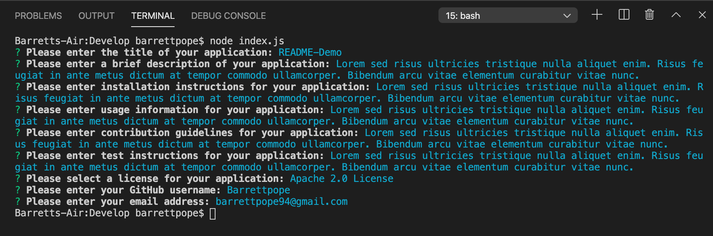
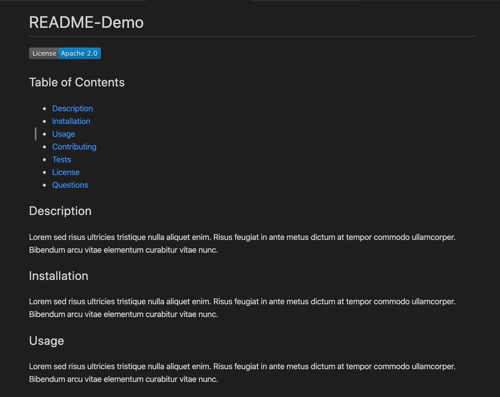
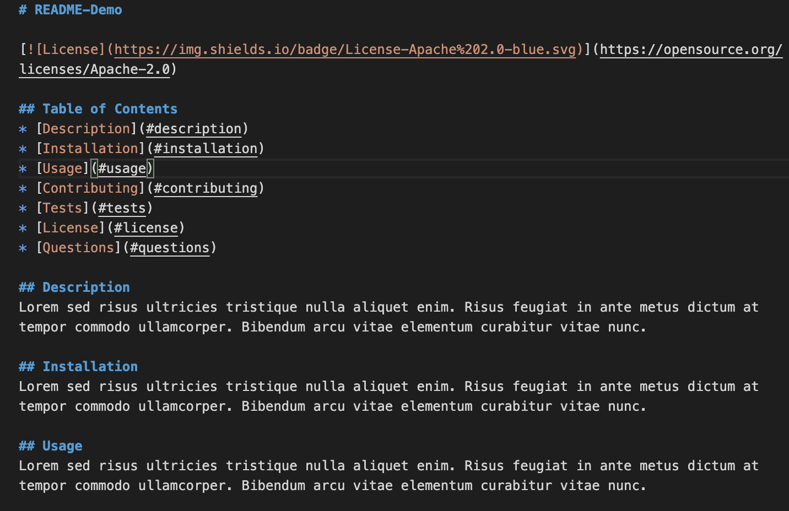

# README-Generator
README-Generator is a command-line application that dynamically generates a professional README.md from a user's input using the Inquier package.

## Description
Upon invoking the application using the command, node index.js, users are directed through a series of prompts pertaining to each section of a quality README. Users enter their inputs & selections accordingly and are then presented with a newly-created README.md file specific to their application. This allows a project creator to spend more time working on finishing the project and less time creating a good README. The following sections are provided in the README-Generator:

* Table of Contents
* Description
* Installation
* Usage
* Contributing
* Tests
* License
* Questions

## Visuals

## Link to Application Demo
https://barrettpope.github.io/Weather-Dashboard/

## Support
For questions, comments or concerns regarding the README-Generator, please email barrettpope94@gmail.com.

## Contributing
Pull requests are welcome.